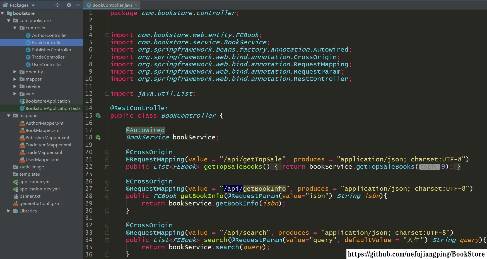
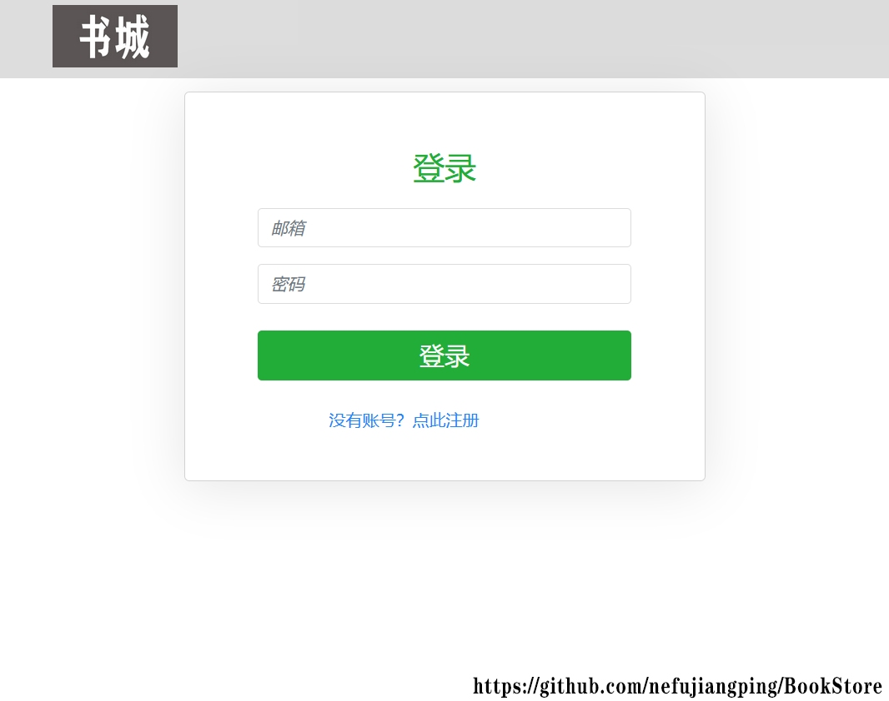
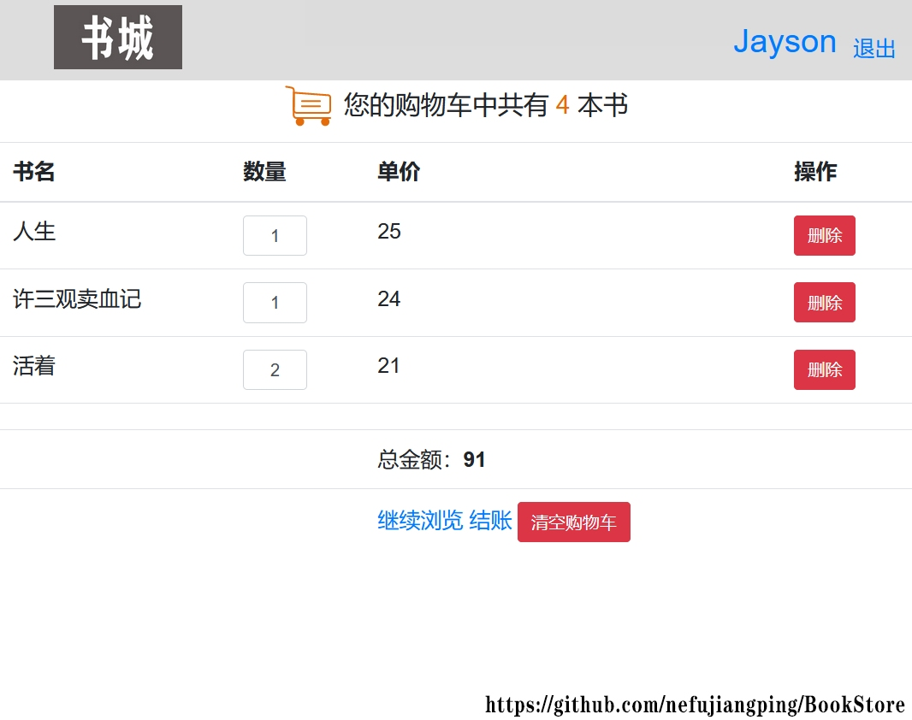
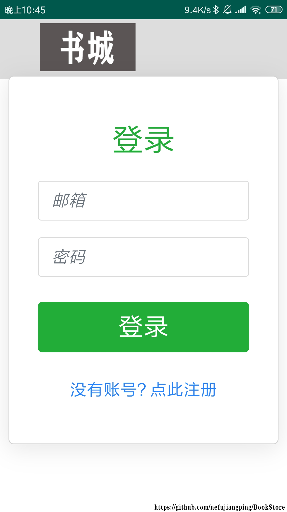

# BookStore
完整的简易书城。实现服务器，Web和Android三端。

## 框架使用
- Server: 使用Spring Boot + MyBatis
- Web-Client: 使用Webpack+Vue2.0+vuex+router+axios，参考[Vue2.0_CNode.bbs](https://github.com/SD-Gaming/Vue2.0_CNode.bbs)和[理工优选](https://github.com/wongself/bityou)
- Android: 使用WebView直接加载Web端首页

## 开发环境
- Server: IntelliJ IDEA
- Web-Client: Hbuilder X
- Android: Android Studio
可使用对应IDE导入

## 配置
- 配置Server端
   + 导入初始数据：[db_bookstore.sql](Server-bookstore/src/main/resources/db_bookstore.sql)
   + 数据库[用户名/密码](https://github.com/nefujiangping/BookStore/blob/02e08730f5a31e76c19caba9a119beaef9330119/Server-bookstore/src/main/resources/application-dev.yml#L6)
   + [端口](https://github.com/nefujiangping/BookStore/blob/02e08730f5a31e76c19caba9a119beaef9330119/Server-bookstore/src/main/resources/application-dev.yml#L2)
- 配置Web-Client端
   + 指定[API-URL](https://github.com/nefujiangping/BookStore/blob/02e08730f5a31e76c19caba9a119beaef9330119/Web-Client-bookstore/src/main.js#L14)
   + 配置Client[端口](https://github.com/nefujiangping/BookStore/blob/02e08730f5a31e76c19caba9a119beaef9330119/Web-Client-bookstore/config/index.js#L26)
- 配置Android端
   + 指定[Client首页URL](https://github.com/nefujiangping/BookStore/blob/02e08730f5a31e76c19caba9a119beaef9330119/Android-BookStore/app/src/main/res/values/strings.xml#L11)

## 系统截图
- 服务器端结构

    

- Web端

 
    

    

    

- Android端

   &nbsp;&nbsp;
   &nbsp;&nbsp;
   

